# pi-agent-space Architecture

**TL;DR.** pi-agent-space is a Bayesian combinatorial-optimization system that searches for high-performing **packages** — bundles of skills, prompts, workflows, foundation-model selections, and configuration values that plug into Pi's extension surface. Trials are run, scored, and persisted through pluggable **ports** in a hexagonal Python implementation. A Haskell DSL and a categorical paper (`docs/math.pdf`) are *precursors* that informed the design and continue to discipline architectural decisions, but the Python codebase under `python/src/pi_evaluator/` is what the project actually is — the source of truth.

This document orients new readers (and LLMs) to the moving parts and how they fit together.

## Contents

- [Module Map](#module-map)
- [What pi-agent-space Optimizes](#what-pi-agent-space-optimizes)
- [Source of Truth and Precursors](#source-of-truth-and-precursors)
- [Architecture in Layers](#architecture-in-layers)
- [Key Domain Types](#key-domain-types)
- [The Four Ports](#the-four-ports)
- [Trial Persistence Layout](#trial-persistence-layout)
- [Precursor: The Haskell DSL](#precursor-the-haskell-dsl)
- [Precursor: The Categorical Paper](#precursor-the-categorical-paper)
- [Modeling External Architectures](#modeling-external-architectures)
- [See Also](#see-also)

---

## Module Map

```mermaid
flowchart TB
    classDef external fill:#fef3c7,stroke:#92400e,color:#92400e
    classDef domain fill:#e0f2fe,stroke:#075985,color:#075985
    classDef port fill:#ede9fe,stroke:#5b21b6,color:#5b21b6
    classDef adapter fill:#dcfce7,stroke:#166534,color:#166534
    classDef runner fill:#fde68a,stroke:#92400e,color:#92400e
    classDef precursor fill:#fce7f3,stroke:#9d174d,color:#9d174d

    subgraph external [External]
        Pi[Pi CLI binary<br/><i>builder harness</i>]
        FS[Filesystem<br/><i>trials/, graduated_problems/</i>]
    end

    subgraph py [Python implementation - pi_evaluator - source of truth]
        Runner[TrialRunner<br/><i>orchestrator</i>]:::runner

        subgraph domainBox [Domain - pure data + identity]
            Types[domain.types<br/>Package, Trial, Outcome,<br/>RawTelemetry, Metrics, ...]:::domain
            Identity[domain.identity<br/>candidate_identity hash]:::domain
            TestSuite[domain.test_suite<br/>GraduatedProblem,<br/>ValidationStep]:::domain
        end

        subgraph portsBox [Ports - Protocol interfaces]
            AHP[AgentHarnessPort]:::port
            SP[ScoringPort]:::port
            PP[PersistencePort]:::port
            ESP[EvalSuiteSourcePort]:::port
        end

        subgraph adaptersBox [Adapters]
            CLI[CliSubprocessAdapter]:::adapter
            StubH[StubAgentHarnessAdapter]:::adapter
            SSS[SyntheticSuiteScorer]:::adapter
            StubS[StubScorer]:::adapter
            PTD[PerTrialDirectoryAdapter]:::adapter
            GPS[GraduatedProblemSetAdapter]:::adapter
            WS[workspace.materialize_workspace<br/><i>helper</i>]:::adapter
        end
    end

    subgraph precursors [Precursors - inform the implementation]
        AGS[AgentSpace.hs<br/>AgentGraph GADT,<br/>Outcome, paretoFrontier,<br/>predictPerformance]:::precursor
        HPorts[Ports.hs<br/>3 pure ports]:::precursor
        Math[docs/math.pdf<br/>categorical formalism,<br/>parametric lens, HetGP]:::precursor
        OCA[OpenClawArchitecture.hs<br/><i>case study</i>]:::precursor
        CCA[ClaudeCodeArchitecture.hs<br/><i>case study</i>]:::precursor
    end

    Pi:::external
    FS:::external

    Runner --> AHP
    Runner --> SP
    Runner --> PP
    Runner --> ESP
    Runner --> Types

    CLI -. implements .-> AHP
    StubH -. implements .-> AHP
    SSS -. implements .-> SP
    StubS -. implements .-> SP
    PTD -. implements .-> PP
    GPS -. implements .-> ESP

    CLI --> WS
    CLI --> Pi
    PTD --> FS
    GPS --> FS

    Identity --> Types
    TestSuite --> Types

    AGS -. informs .-> Types
    HPorts -. informs .-> portsBox
    Math -. informs .-> AGS
    Math -. informs .-> Types
    OCA --> AGS
    CCA --> AGS
```



**Reading the diagram.** Solid arrows are runtime calls (`A → B` means *A invokes B*). Dotted **implements** arrows mean an adapter satisfies a port's `Protocol`. Dotted **informs** arrows mean the precursor artifact shaped the implementation's design at some point — they do not mean drift is checked in real time. The Python implementation is canonical.

---

## What pi-agent-space Optimizes

The system under optimization is the pair **(Pi harness, package)**. Pi is the *builder harness* — the binary that takes a model + prompt + tool list and runs an agent loop. A **package** is the bundle of inputs that plug into Pi's extension surface: model selection, system prompt, skills (Pi tool names), and templated configuration values.

The optimizer's job: given a graduated problem suite (e.g., coding problems of increasing difficulty), find the packages on the Pareto frontier of `(tokens, dollars, scaling-slope, quality)` — and, when subjective scoring lands, on the 5D extension that includes human/LLM-judge ratings.

The framing draws on three strands:

- **Bockeler's harness layers** (model / builder / user) — Pi is the builder harness, the package's foundation-model selection is the model, and the rest of the package items constitute the *user harness* (guides + sensors). See `docs/terminology.md`.
- **Computational vs. inferential items** — items in the user harness are tagged on a 2×2 of (role: guide/sensor, type: computational/inferential). Substituting an inferential item for a computational one of the same lens shape is strictly Pareto-dominant; the optimizer can exploit a known-equivalent catalog ahead of any random move.
- **Categorical cybernetics** — the user harness wrapping a parameterized agent has the structure of a parametric lens (Capucci et al. 2021). The math paper formalizes this; ADRs 0006 and 0007 added the heteroscedastic noise commitment and the trial-outcome sum type to that formal core.

---

## Source of Truth and Precursors

A new reader should know which artifact to trust when they appear to disagree.

**Python (`python/src/pi_evaluator/`) is canonical.** It is what the optimizer actually does: trials run, scoring happens, files land on disk. Behavioral questions ("does the trial runner emit `outcome` on the finalized event?", "does the identity hash canonicalize skill order?") are answered by reading the Python and its tests.

**The Haskell DSL and the math paper are precursors.** They informed the Python's design by working out the categorical structure first — typed agent graphs as a strict monoidal GADT, the four ports as records of functions, the user harness as a parametric lens, the trial outcome as a sum type. They continue to inform the Python: when an ADR lands that refines the domain (ADR 0006's heteroscedastic noise, ADR 0007's outcome enum), the Haskell types and the math paper are updated alongside the Python so the precursor artifacts stay coherent with the implementation.

But drift between Haskell/math and Python is **not** caught in real time, and the Python is the resolver. If the Haskell `Trial` placeholder lags behind a Python `Trial` field rename, the Python is right and the Haskell catches up at the next phase boundary. If the math paper's `predictPerformance` signature describes a stricter return type than the Python implementation, the Python is right and the paper updates at its next pass.

This convention is captured in project memory as *"Haskell DSL is a thinking tool — not source-of-truth; reconcile drift post hoc"*.

---

## Architecture in Layers

The Python side follows the **hexagonal** (ports-and-adapters) shape — domain at the centre, ports as the surface, adapters at the edge, orchestration on top. Four layers, no upward dependencies. The convention is documented in `docs/implementation-plan.md` and `docs/terminology.md` rather than in a dedicated ADR.

### Domain (`pi_evaluator/domain/`)

Pure data. No I/O, no third-party dependencies beyond the standard library, no framework imports. Frozen dataclasses for value types; `Trial` is the one mutable type because events accrue across phases.

- `types.py` — `Package`, `Trial`, `TrialEvent`, `Outcome`, `RawTelemetry`, `Metrics`, `SubjectiveScore`, `EvalSuiteRef`, `VersionVector`, `ValidationResult`.
- `identity.py` — `candidate_identity(...)`: a SHA-256 over a canonical JSON envelope of `(package_diff, eval_suite_ref, version_vector)` for proposer dedup. Skills are canonicalized as a sorted list before hashing (Pi treats `--tools` as order-insensitive).
- `test_suite.py` — `GraduatedProblem`, `ValidationStep`.

### Ports (`pi_evaluator/ports/`)

`typing.Protocol` definitions. The ports are the seams along which adapters plug in; they are intentionally narrow — each one expresses a single domain operation.

- `agent_harness_port.py` — run an agent against a problem.
- `scoring_port.py` — derive metrics from telemetry; ingest async subjective scores.
- `persistence_port.py` — save/append/finalize/load over the four-file trial layout.
- `eval_suite_source_port.py` — load problems from a source.

### Adapters (`pi_evaluator/adapters/`)

Concrete implementations of the ports. Stub adapters (`stub_*`) exist for Phase 1's pure pipeline; real adapters (`cli_subprocess_adapter`, `synthetic_suite_scorer`, `per_trial_directory_adapter`, `graduated_problem_set_adapter`) entered in Phase 2.

`workspace.py` is a small helper used by the CLI adapter — it copies `GraduatedProblem.workspace_dir` into a tempdir per [ADR 0004](../adrs/0004-workspace-isolation.md) so trials cannot mutate shared problem state.

### Orchestration (`pi_evaluator/trial_runner.py`)

`TrialRunner` composes the four ports into the trial pipeline:

```
configured → (eval, scored_objective)+ → finalized
```

`TrialRunner._aggregate` rolls per-problem metrics into trial-level aggregates (sum of tokens, mean of rates). `TrialRunner._classify_outcome` maps per-problem `RawTelemetry` to the [ADR 0007](../adrs/0007-pi-invocation-lifecycle.md) trial outcome enum (`completed`, `boundary_violation`, `error_escalated`).

---

## Key Domain Types

### `Package`

```python
@dataclass(frozen=True)
class Package:
    model: str               # "<provider>/<id>" e.g. "google/gemini-2.5-flash"
    system_prompt: str
    skills: list[str]        # set-valued; Pi's --tools is order-insensitive
    template_values: dict[str, str]
```

The variable being optimized. `skills` is set-valued at the semantic level (Pi's `--tools` flag is order-insensitive — verified against 0.74) but stored as `list[str]` for JSON-serialization stability. The candidate-identity hash sorts skills before hashing.

### `Trial` and `Outcome`

```python
@dataclass
class Trial:
    trial_id: str
    package: Package
    eval_suite_ref: EvalSuiteRef
    version_vector: VersionVector
    events: list[TrialEvent]
    final_metrics: Metrics | None
    subjective_score: SubjectiveScore | None
    outcome: Outcome | None  # ADR 0007

Outcome = Literal["completed", "boundary_violation", "error_escalated"]
```

A trial moves through phases — `configured → (eval, scored_objective)+ → finalized` — accumulating events. The `outcome` field, set at finalize-time, is the ADR 0007 sum: a *completed* trial yielded full metrics; a *boundary_violation* trial crossed a configured boundary (timeout, cost cap) and contributes to the surrogate as a cost-cliff data point; an *error_escalated* trial is preserved for asynchronous human classification and does not feed the surrogate.

### `RawTelemetry`

```python
@dataclass(frozen=True)
class RawTelemetry:
    events: list[dict]                  # parsed Pi event stream
    exit_code: int
    validation_results: list[ValidationResult]
    stderr: str                         # captured for failure classification
    malformed_lines: list[str]          # preserved, never silently dropped
```

What the harness adapter returns. The `events` list is intentionally permissive (`list[dict]`); the scorer's coupling to specific event-schema fields (e.g., `usage.totalTokens`, `usage.cost.total`, `stopReason`) is the actual versioning surface against Pi.

### `Metrics`

```python
@dataclass(frozen=True)
class Metrics:
    tokens_consumed: int
    validation_pass_rate: float
    quality_score: float
```

Phase 1+2 scalar shape. Per [ADR 0005](../adrs/0005-trial-cost-and-budget.md), `cost_dollars: float` will join — the Pareto frontier becomes 4D `(mean_tokens, mean_dollars, scaling_slope, mean_quality)`, becoming 5D once subjective scoring lands. Phase 4 lifts this further to a capability-profile aggregation across difficulty levels.

---

## The Four Ports

Each port is a `typing.Protocol`. Stub and real adapters satisfy each port; tests against stubs exercise the orchestration logic without touching Pi or the filesystem.

### `AgentHarnessPort`

```python
class AgentHarnessPort(Protocol):
    def run(self, package: Package, problem: GraduatedProblem,
            workspace: str) -> RawTelemetry: ...
```

The boundary between abstract package definition and concrete execution. `CliSubprocessAdapter` shells out to the real Pi binary; `StubAgentHarnessAdapter` returns canned `RawTelemetry`. Workspace materialization is an internal concern of the CLI adapter, not a separate port (see ADR 0004).

### `ScoringPort`

```python
class ScoringPort(Protocol):
    def score_objective(self, telemetry: RawTelemetry) -> Metrics: ...
    def score_subjective(self, trial: Trial) -> SubjectiveScore | None: ...
```

The two-method split mirrors the Bockeler computational/inferential distinction. `score_objective` is deterministic and runs synchronously inside the trial loop; `score_subjective` may be async and may not return a value. `SyntheticSuiteScorer` (real, derives metrics from Pi telemetry) and `StubScorer` (canned) implement the port.

### `PersistencePort`

```python
class PersistencePort(Protocol):
    def save_trial(self, trial: Trial) -> None: ...
    def append_event(self, trial_id: str, event: TrialEvent) -> None: ...
    def finalize_trial(self, trial_id: str, final_metrics: Metrics,
                       outcome: Outcome,
                       subjective_score: SubjectiveScore | None = None) -> None: ...
    def load_trials(self) -> list[Trial]: ...
```

The four-file trial directory layout per [ADR 0003](../adrs/0003-trial-persistence.md) is the contract. `PerTrialDirectoryAdapter` is the v1 implementation; an SQL backend is one of the documented reconsider triggers.

### `EvalSuiteSourcePort`

```python
class EvalSuiteSourcePort(Protocol):
    def load(self) -> list[GraduatedProblem]: ...
```

Loading the problem set is at the I/O edge; once loaded, the suite is just data that flows into `TrialRunner`. `GraduatedProblemSetAdapter` reads a directory of `problem.json` files; the workspace path is resolved to the on-disk problem directory.

---

## Trial Persistence Layout

Each closed trial sits in `trials/{trial_id}/` with four files (per ADR 0003):

| File | Contents | Purpose |
| --- | --- | --- |
| `config.json` | `trial_id`, `package`, `eval_suite_ref` | What was proposed |
| `versions.json` | `pi_version`, `package_versions`, `eval_suite_version` | Frozen-at-trial-start version snapshot |
| `events.jsonl` | One event per line: `{phase, timestamp, payload}` | Phase-by-phase trial trace |
| `final.json` | `metrics`, `outcome`, `subjective_score` | Trial close-out |

`config.json` and `versions.json` answer different questions about a trial — what we proposed vs. what was actually frozen — and stay separate so the version vector is independently greppable across trials. `events.jsonl` is append-only during the trial lifecycle; `final.json` is written atomically (write-temp + rename) at trial close.

---

## Precursor: The Haskell DSL

Files: `haskell/src/{AgentSpace.hs, Ports.hs, ClaudeCodeArchitecture.hs, OpenClawArchitecture.hs}`.

The Haskell side worked out the categorical structure before the Python landed:

1. **`AgentSpace.hs`** defines `AgentGraph` as a strict monoidal GADT — `Id`, `Seq`, `Par`, `Copy`, `Drop`, `Choice`, `Loop`, plus domain morphisms (`CallModel`, `ApplySkill`, `RunTests`, `MergeStrings`, …). The GADT's typed shape gives the Haskell compiler the ability to reject ill-formed agent topologies at compile time. ADR 0007's `Outcome` sum (`Completed Metrics | BoundaryViolation Metrics | ErrorEscalated`) and ADR 0006's `NoisyEstimate` (mean + variance) are pinned down here as types so the math and the optimizer can rely on them.

2. **`Ports.hs`** mirrors the Python ports as a 3-port pure cut (`AgentHarnessPort`, `ScoringPort`, `PackageProposerPort`). Persistence and eval-suite-loading are deliberately omitted — they are I/O at the edges and have Python homes. The 3:5 mismatch with Python is paid in `docs/terminology.md`.

3. **The case studies** (`OpenClawArchitecture.hs`, `ClaudeCodeArchitecture.hs`) demonstrate the DSL is expressive enough to capture real and speculative agent architectures — see [Modeling External Architectures](#modeling-external-architectures) below.

The Haskell continues to receive ADR-driven updates so the precursor stays honest, but it does not validate the Python in real time. When Python and Haskell disagree, Python is right.

---

## Precursor: The Categorical Paper

File: `docs/math.tex` (built to `docs/math.pdf`).

The paper formalizes the same structure as a strict monoidal category:

- **Section II** — agent workflows as morphisms in a monoidal category, composition and routing primitives, advanced control (choices, loops, parameterized morphisms via Para).
- **Section III** — the case studies as morphism diagrams.
- **Section IV** — Pareto frontier evaluation; surrogate modeling and acquisition. Post-ADR-0006, `predictPerformance` returns both conditional mean and input-dependent variance (heteroscedastic GP); below the bootstrap threshold, acquisition reverts to pure exploration.
- **Appendix A** — user-harness feedback as a parametric lens (Capucci et al. 2021), the computational/inferential typing and the substitution principle, partial/asynchronous feedback as an affine traversal, and (post-ADR-0007) the trial-outcome sum type with its metric-bearing projection π : Outcome → Maybe(Metrics).

The paper is a reading aid and a discipline. It does not run anything.

---

## Modeling External Architectures

A useful test of the precursor's expressiveness is whether it can describe real-world agent architectures cleanly. Two case studies in `haskell/src/{ClaudeCodeArchitecture.hs, OpenClawArchitecture.hs}` exercise this — one speculative (reconstructed from a March 2026 leak) and one real (OpenClaw, the deployed messaging-gateway package).

### The Claude Code Example

The Claude Code architecture coordinates a session and spawns isolated sub-agents for parallel work. In the DSL, this is the strict monoidal tensor product (`***` / `Par`) plus the `Copy` routing primitive to safely duplicate context, followed by `MergeStrings` to gather results.

```haskell
-- Forks the context to parallel sub-agents (Explore, Plan)
coordinatorSubAgents :: AgentGraph (Prompt, Context) Code
coordinatorSubAgents =
    Copy
    >>> ( (Id >>> CallModel "Claude-3-Haiku-Explore")
          ***
          (Id >>> CallModel "Claude-3-Opus-Plan")
        )
    >>> MergeStrings
```

The "Dreaming" memory-consolidation routine — taking a modified context and feeding it back into the loop — cannot be modeled by a DAG. We use a categorical **trace**, implemented in the DSL via `ArrowLoop`:

```haskell
-- The Claude Code "Dreaming" (Memory Consolidation) Loop
dreamingLoop :: AgentGraph Code TestResult
dreamingLoop = loop DreamSkill
```

Hidden features (KAIROS background daemon, Undercover metadata-stripping mode) compose as ordinary skills:

```haskell
claudeCodeWorkflow :: AgentGraph (Prompt, Context) TestResult
claudeCodeWorkflow =
    coordinatorSubAgents
    >>> ApplySkill "KAIROS_Background_Refactor"
    >>> ApplySkill "Strip_CoAuthoredBy_Metadata"
    >>> RunTests
```

The GADT's typing means the Haskell compiler proves the topological connections are well-formed (e.g., the output of the KAIROS daemon matches the required input for Undercover Mode) before any execution.

### The OpenClaw Example

OpenClaw implements a messaging gateway by directly importing and instantiating Pi's `AgentSession` rather than spawning it as a subprocess. The embedded paradigm requires custom tool injection, dynamic system prompt construction, and parallel event subscription for streaming intermediate results.

A custom tool-policy pipeline — context-modifying operations composed sequentially:

```haskell
toolPipeline :: AgentGraph Context Context
toolPipeline =
    ApplyContextSkill "Filter_Tools_By_Policy"
    >>> ApplyContextSkill "Normalize_Tool_Schemas"
    >>> ApplyContextSkill "Enforce_Sandbox_Paths"
```

Event subscription — tapping a stream without interrupting its primary flow — is the `Copy` morphism plus a parallel tensor product, then `ExtractCode` to discard the tap's termination type:

```haskell
agentExecutionWithStreaming :: AgentGraph (Prompt, Context) Code
agentExecutionWithStreaming =
    Copy
    >>> ( CallModel "OpenClaw-Embedded-Session"
          ***
          SubscribeStream
        )
    >>> ExtractCode
```

The full workflow weaves auth resolution, tool policy, and embedded-session execution:

```haskell
openClawWorkflow :: AgentGraph (Prompt, Context) TestResult
openClawWorkflow =
    (Id *** ApplyContextSkill "Resolve_Auth_Profile")
    >>> (Id *** toolPipeline)
    >>> agentExecutionWithStreaming
    >>> RunTests
```

The cases are not ports of these systems into pi-agent-space — they are demonstrations that the categorical primitives chosen for the DSL (and therefore reflected in the Python's `Package` shape and the optimizer's slot space) are expressive enough to describe the architectures we care about optimizing.

---

## See Also

- **[`docs/implementation-plan.md`](../implementation-plan.md)** — phased plan with current Phase 2 closeout state, Phase 3+ ahead.
- **[`docs/adrs/`](../adrs/)** — architecture decisions, indexed by status (Proposed / Accepted / Rejected / Superseded / Withdrawn).
- **[`docs/design-notes.md`](../design-notes.md)** — sub-ADR-weight design choices and their motivations.
- **[`docs/terminology.md`](../terminology.md)** — Bockeler harness-layer and item-type vocabulary.
- **[`docs/math.pdf`](../math.pdf)** — categorical formalism: monoidal structure, Pareto optimization, heteroscedastic surrogate, trial outcome sum.
