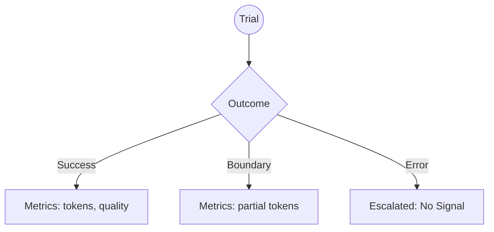
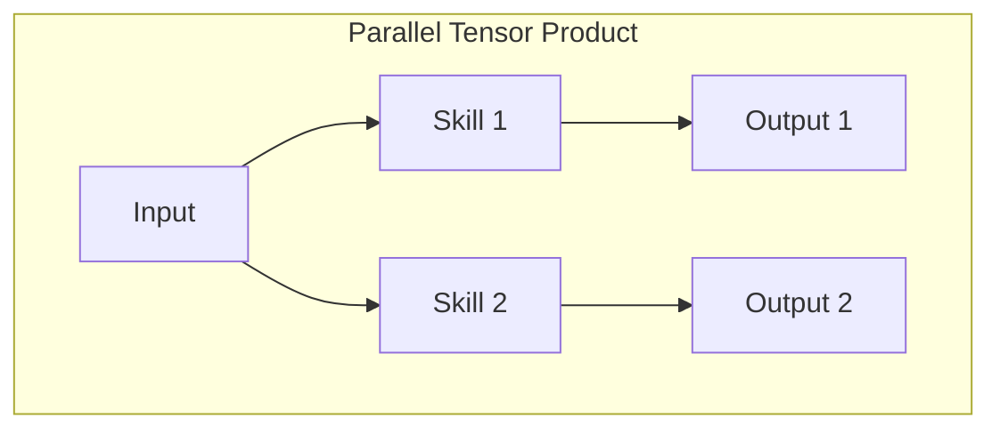

# The Rosetta Stone (Version A: The Architect's Path)

**Perspective:** Top-Down (Deductive)
**Direction:** Math (The Shape) $\to$ Haskell (The Verification) $\to$ Python (The Truth)

This version is for those who want to understand the *reason* for the structure before seeing the implementation. It treats the project as a physical realization of mathematical blueprints.

---

## Trace 1: The Trial Outcome (ADR 0007)

### 1. The Shape (Category Theory)
We model the outcome of a non-deterministic agent run as a **Coproduct** (Sum Type). This is the mathematical representation of "Choice."

$$O = M_{completed} \amalg M_{violated} \amalg 1_{error}$$

**Visualization: The Outcome Map**


### 2. The Verification (Haskell)
Haskell proves this shape. The compiler ensures you cannot accidentally "forget" the metrics in a successful trial.

```haskell
data Outcome
    = Completed Metrics
    | BoundaryViolation Metrics
    | ErrorEscalated
```

### 3. The Truth (Python Context)
In production, the "Pure" sum type from Haskell meets the "Impure" world of filesystem I/O and list-processing. The math provides the filtering logic that makes this messy code predictable.

```python
# Context: Loading and filtering trials for the Pareto frontier
def load_and_filter_trials(storage_path: Path) -> list[Metrics]:
    # 1. Messy I/O (The "Real World")
    raw_trials = [Trial.load(p) for p in storage_path.glob("trial_*")]
    
    # 2. The Implementation of the Projection (pi)
    # We use a list comprehension to filter for branches that carry signal.
    # completed | boundary_violation => signal
    # error_escalated | None         => noise
    return [
        t.final_metrics 
        for t in raw_trials 
        if t.outcome in ("completed", "boundary_violation")
        and t.final_metrics is not None
    ]
```

---

## Trace 2: Composition (The Workflow)

### 1. The Shape (Monoidal Categories)
We use **Monoidal Categories** to describe how agents compose. 
- **Tensor Product ($\otimes$):** Running things in parallel.
- **Composition ($\circ$):** Running things in sequence.

**Visualization: The Monoidal Box**


### 2. The Verification (Haskell)
The `AgentGraph` GADT uses Haskell's type system to "wire" these boxes together safely.

```haskell
-- Proof of a parallel sub-agent workflow
coordinator = Copy >>> (Haiku *** Opus) >>> MergeStrings
```

### 3. The Truth (Python Context)
While Haskell verifies the *wiring*, the Python implementation manages the *execution*—handling asynchronous calls, networking, and state.

```python
# Context: Executing the parallel workflow verified in Haskell
async def execute_coordinator_workflow(prompt: str, context: list[str]):
    # realization of: Copy >>> (Haiku *** Opus)
    # The Tensor Product (***) manifests as asyncio.gather
    haiku_task = run_model("haiku", prompt, context)
    opus_task = run_model("opus", prompt, context)
    
    # Run in parallel (The monoidal 'side-by-side' property)
    haiku_out, opus_out = await asyncio.gather(haiku_task, opus_task)
    
    # realization of: >>> MergeStrings
    return f"{haiku_out}\n{opus_out}"
```
