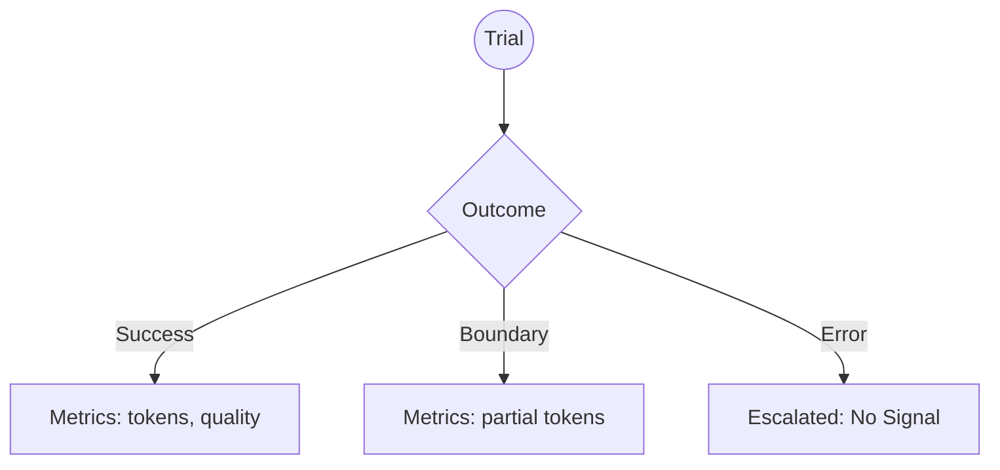
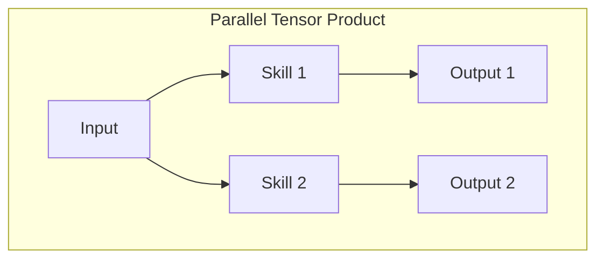

# The Rosetta Stone (Version A: The Architect's Path)

**Perspective:** Top-Down (Deductive)
**Direction:** Math (The Shape) $\to$ Haskell (The Verification) $\to$ Python (The Truth)

This version is for those who want to understand the *reason* for the structure before seeing the implementation. It treats the project as a physical realization of mathematical blueprints.

---

## Trace 1: The Trial Outcome (ADR 0007)

### 1. The Shape (Category Theory)
We model the outcome of a non-deterministic agent run as a **Coproduct** (Sum Type). This is the mathematical representation of "Choice."

$$O = M_{completed} \amalg M_{violated} \amalg 1_{error}$$

**Visualization: The Outcome Map**


### 2. The Verification (Haskell)
Haskell proves this shape. The compiler ensures you cannot accidentally "forget" the metrics in a successful trial.

```haskell
data Outcome
    = Completed Metrics
    | BoundaryViolation Metrics
    | ErrorEscalated
```

### 3. The Truth (Python)
In production, we realize this as a `Literal` and optional fields. The math provides the "linter" that tells us why we need `_has_metrics`.

```python
Outcome = Literal["completed", "boundary_violation", "error_escalated"]
```

---

## Trace 2: Composition (The Workflow)

### 1. The Shape (Monoidal Categories)
We use **Monoidal Categories** to describe how agents compose. 
- **Tensor Product ($\otimes$):** Running things in parallel.
- **Composition ($\circ$):** Running things in sequence.

**Visualization: The Monoidal Box**


### 2. The Verification (Haskell)
The `AgentGraph` GADT uses Haskell's type system to "wire" these boxes together safely.

```haskell
coordinator = Copy >>> (Haiku *** Opus) >>> MergeStrings
```

### 3. The Truth (Python)
Python realizes this as the `Package` configuration. 

```python
@dataclass
class Package:
    skills: list[str]
```
*(In Phase 5, this will become a serialized execution graph mirroring the Haskell structure.)*
