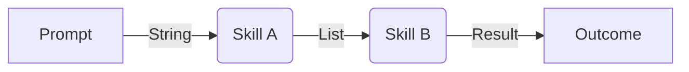

# The Rosetta Stone (Version B: The Builder's Path)

**Perspective:** Bottom-Up (Inductive)
**Direction:** Python (The Truth) $\to$ Haskell (The Verification) $\to$ Math (The Shape)

This version is for developers who want to start with the code they know and see how it scales up into more powerful abstractions.

---

## Trace 1: The Trial Outcome (ADR 0007)

**The Python Intuition:** We need to know if a trial succeeded or crashed so we can filter our data.
**Analogy:** The `Result` type in Rust or `Either` in modern Python.

### 1. The Truth (Python)
We use a `Literal` and optional fields to track the status. We have to manually remember to check `outcome` before using `final_metrics`.

```python
# Truth: Simple enums and checks
Outcome = Literal["completed", "boundary_violation", "error_escalated"]

if trial.outcome != "error_escalated":
    process(trial.final_metrics)
```

### 2. The Verification (Haskell)
We take that intuition and make it a **Type**. Now, the compiler *forces* us to handle the error case. You cannot even "see" the metrics unless you are in a valid branch.

```haskell
-- Verification: The data structure enforces the logic
data Outcome
    = Completed Metrics
    | BoundaryViolation Metrics
    | ErrorEscalated
```

### 3. The Shape (Category Theory)
We generalize this into a **Coproduct** ($\amalg$). This is the math of "mutual exclusivity." It’s the universal law that governs why our `if/else` logic works.

---

## Trace 2: Composition (The Workflow)

**The Python Intuition:** We want to chain tools together or run them in parallel.
**Analogy:** Middleware in FastAPI or Pipes in a shell.

### 1. The Truth (Python)
Currently, we store a simple list of `skills`. The agent "knows" how to use them.

```python
package = Package(skills=["linter", "test-runner"])
```

### 2. The Verification (Haskell)
We formalize how these skills "plug in" to each other using **Arrows**. This prevents "wiring bugs" (e.g., trying to pass a list into a function that expects a string).

**Visualization: The Typed Wire**


### 3. The Shape (Category Theory)
We recognize this as a **Monoidal Category**. It tells us that we can treat complex workflows exactly like simple ones. If "A then B" is a valid agent, and "C then D" is a valid agent, then "(A then B) in parallel with (C then D)" is also a valid agent.

---

## Summary: Scaling Your Intuition

| Your Intuition | The Formal Tool | The Mathematical Law |
| :--- | :--- | :--- |
| "It's one of these three things" | Sum Type / Enum | Coproduct ($\amalg$) |
| "Do A, then do B" | Composition (`>>>`) | Morphism Composition ($\circ$) |
| "Do A and B at the same time" | Parallel Tensor (`***`) | Tensor Product ($\otimes$) |
| "Filter out the noise" | Projection function | Projection ($\pi$) |
